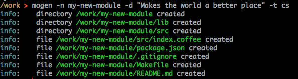

```
  ,____,   _,_ __   _   ,__, 
_/ / / (__(_/_(_/__(/__/ / (_
              _/_            
             (/              
```

# MOdule starter GENerator

*Generate starting files and directories for a node module*


###Example output###


```
$ npm install mogen -g
```

# license

MIT


